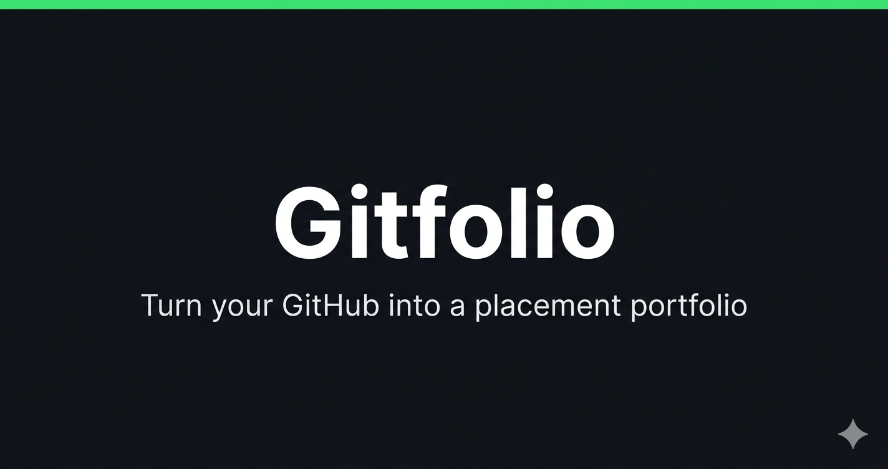
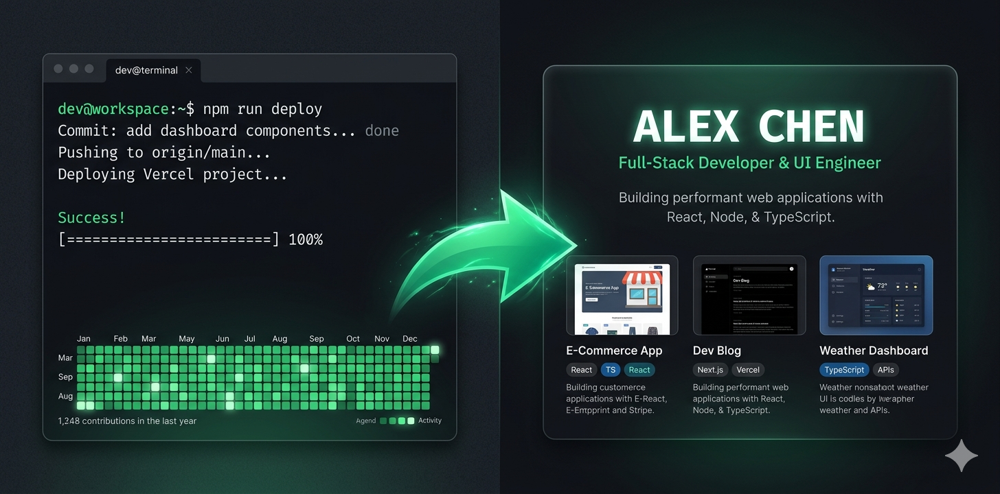

<p align="center">
  
</p>

<h1 align="center">🚀 Gitfolio — From Code to Career</h1>

<p align="center">
  <strong>Turn your GitHub into a placement-ready developer portfolio with analytics, AI-powered improvement suggestions, and a shareable public page.</strong>
</p>

<p align="center">
  <a href="https://gitfolio.harmnix.com">
    
  </a>
  
  
  
  
  
</p>

---

## 📑 Table of Contents

- [Preview](#-preview)
- [Overview](#-overview)
- [How It Works](#-how-it-works)
- [Features](#-features)
- [Tech Stack](#-tech-stack)
- [Architecture](#-architecture)
- [Getting Started](#-getting-started)
- [Project Structure](#-project-structure)
- [License](#-license)

---

## 🖼️ Preview

<p align="center">
  
</p>

---

## 📋 Overview

Gitfolio is a browser-based developer portfolio analyzer built for Indian engineering students and fresh graduates navigating campus placements. It connects to your GitHub account, analyzes your repositories, commit history, language proficiency, and contribution patterns, then produces a quantified **Interview Readiness Score** along with a professional, shareable portfolio page.

The app is entirely frontend-driven with no user database — all GitHub data is fetched live via the GitHub REST and GraphQL APIs, cached locally in IndexedDB via Dexie.js, and never stored on a server. A Cloudflare Worker backend handles GitHub OAuth device flow, Razorpay payment processing, and AI-powered features.

> 🔒 **Privacy-first and serverless.** User data stays in the browser, GitHub tokens are encrypted with AES-256-GCM in sessionStorage, and no email or signup is required to use the free tier.

---

## ⚡ How It Works

```
Connect GitHub  →  Analyze Profile  →  Get Your Score  →  Share Portfolio
```

| Step | What Happens |
|------|-------------|
| **1. Connect** | Authorize via GitHub Device Flow — no redirects, no stored passwords |
| **2. Analyze** | Repositories, commits, languages, and contributions scored across 5 dimensions |
| **3. Score** | Receive a 0–100 Interview Readiness Score with detailed per-dimension breakdowns |
| **4. Share** | Your public portfolio page goes live at `/u/your-username` instantly |

---

## ✨ Features

### 📊 GitHub Profile Analysis
- **Interview Readiness Score** — Weighted composite (0–100) from project quality, language depth, contribution consistency, profile completeness, and code hygiene
- **Language Depth Scoring** — Normalized depth score per language based on byte volume, repo count, and months of activity
- **Domain Classification** — Automatically classifies you into frontend, backend, fullstack, ML/AI, mobile, devops, systems, or DSA/CP
- **Contribution Analytics** — Streaks, active days, consistency score, placement-season ratio
- **Project Quality Scoring** — 10-criteria scoring per repo (README, description, stars, commits, etc.)

### 🌐 Shareable Public Portfolio
- **Public Profile Page** — `https://your-domain.com/u/:username` with avatar, score gauge, projects, and SEO meta tags
- **QR Code** — Auto-generated QR for your portfolio link
- **GitHub README Badges** — SVG skill badges for your profile README

### 🤖 AI-Powered Features *(Premium)*
- **Repository Improver** — AI-generated README outlines and descriptions
- **Job Match Analyzer** — Paste a JD and get a match score, gaps, and recommendations
- **LinkedIn Bio Generator** — Professional summary from your GitHub data
- **Company Fit Score** — See how ready you are for specific companies
- **Interview Questions** — 20 hyper-personalized questions based on your profile
- **Resume Bullets** — ATS-friendly bullet points for your repos

### 💳 Premium Monetization
- **Upgrade Modal** — ₹299/month or ₹999 lifetime via Razorpay
- **License Verification** — Backend-validated license keys with rate limiting

### 🛠️ Additional Tools

| Tool | Description |
|------|-------------|
| **Placement Card** | A5 business card with QR code (print-ready) |
| **College Leaderboard** | Compare scores with peers from your college |
| **PDF Portfolio Export** | Multi-page A4 PDF with two templates |
| **LeetCode & Codeforces** | Combined placement score integration |
| **Open Source Finder** | Discover open source contribution opportunities |
| **Application CRM** | Track your job applications end-to-end |
| **Peer Benchmarking** | See your percentile vs college peers |

---

## 🏗️ Tech Stack

| Layer | Technology |
|-------|-----------|
| **Frontend** | React 19, Vite 8, Tailwind CSS 3, Framer Motion 12 |
| **Backend** | Cloudflare Workers (Edge Runtime) |
| **Cache** | Cloudflare KV |
| **Database** | IndexedDB (Dexie.js 4) — client-side only |
| **Auth** | GitHub OAuth Device Flow |
| **Payments** | Razorpay |
| **AI** | Anthropic Claude (Premium) / Llama 3 (Free) / Gemini (Fallback) |
| **PDF** | jsPDF + html2canvas |
| **SEO** | react-helmet-async |
| **Icons** | Lucide React |
| **Hosting** | Cloudflare Pages |

---

## 🧠 Architecture

```
React 19 Frontend → Cloudflare Workers (Edge) → KV Storage → GitHub API
```

| Component | Detail |
|-----------|--------|
| **Authentication** | GitHub Device Flow (no redirect-based OAuth). Token encrypted with AES-256-GCM in sessionStorage |
| **Data Flow** | All GitHub data fetched via live API calls, cached in IndexedDB with TTL-aware cache-first strategy |
| **Analytics Engine** | Heavy computation offloaded to a Web Worker to keep the UI responsive |
| **AI Orchestration** | Multi-model with automatic fallback — Claude → Llama 3 → Gemini |
| **Premium Validation** | License-based with backend validation via Cloudflare KV |

---

## 🚀 Getting Started

### Prerequisites
- Node.js 18+ and npm
- A GitHub account (for testing)
- A Cloudflare account (for deploying the Workers backend)

### 1. Clone & Install

```bash
# Clone the repository
git clone https://github.com/yourusername/Gitfolio.git
cd Gitfolio/gitfolio

# Install frontend dependencies
npm install

# In another terminal, install workers dependencies
cd ../gitfolio-workers
npm install
```

### 2. Configure Environment Variables

Create a `.env` file in the `gitfolio/` directory:

```env
VITE_GITHUB_CLIENT_ID=your_github_oauth_client_id
VITE_WORKER_URL=https://your-worker.your-subdomain.workers.dev
```

| Variable | Required | Description | Where to Get It |
|----------|:--------:|-------------|-----------------|
| `VITE_GITHUB_CLIENT_ID` | ✅ | GitHub OAuth App client ID for device flow | GitHub Settings → Developer settings → OAuth Apps |
| `VITE_WORKER_URL` | ✅ | Base URL of the Cloudflare Worker backend | Your deployed Worker URL |

### 3. Run Locally

```bash
cd gitfolio
npm run dev
```

> App runs at **`http://localhost:5173`**

### 4. Deploy

**Workers backend:**
```bash
cd gitfolio-workers
npx wrangler deploy
```

**Frontend to Cloudflare Pages:**
```bash
cd gitfolio
npm run build
npx wrangler pages deploy dist --project-name=gitfolio
```

---

## 📁 Project Structure

```
Gitfolio/
├── gitfolio/                      # Frontend application (React + Vite)
│   ├── src/
│   │   ├── pages/                 # Route pages (Landing, Dashboard, PublicPortfolio)
│   │   ├── components/            # Reusable UI components
│   │   ├── services/              # API clients (GitHub, auth, payment, AI)
│   │   ├── analytics/             # Scoring engine (language, project, contribution)
│   │   ├── hooks/                 # Custom React hooks
│   │   ├── context/               # React contexts (Auth, Premium)
│   │   ├── workers/               # Web Worker for analytics computation
│   │   └── utils/                 # Utility functions
│   ├── public/                    # Static assets
│   └── config files               # Vite, Tailwind, ESLint, etc.
├── gitfolio-workers/              # Cloudflare Workers backend
│   ├── src/handlers/              # Auth, AI, Payment, License, Leaderboard, Badge
│   └── wrangler.toml              # Worker configuration
├── LICENSE
└── README.md
```

---

## 📄 License

This software is **Freemium** — not open source. See the [LICENSE](LICENSE) file for details.

| Tier | Terms |
|------|-------|
| **Free Tier** | Personal, non-commercial use permitted |
| **Premium Features** | Require a valid paid license |
| **Commercial Use** | Prohibited without explicit written permission |

---

<p align="center">Built with ❤️ by <a href="https://harmnix.com">Harmnix</a></p>
